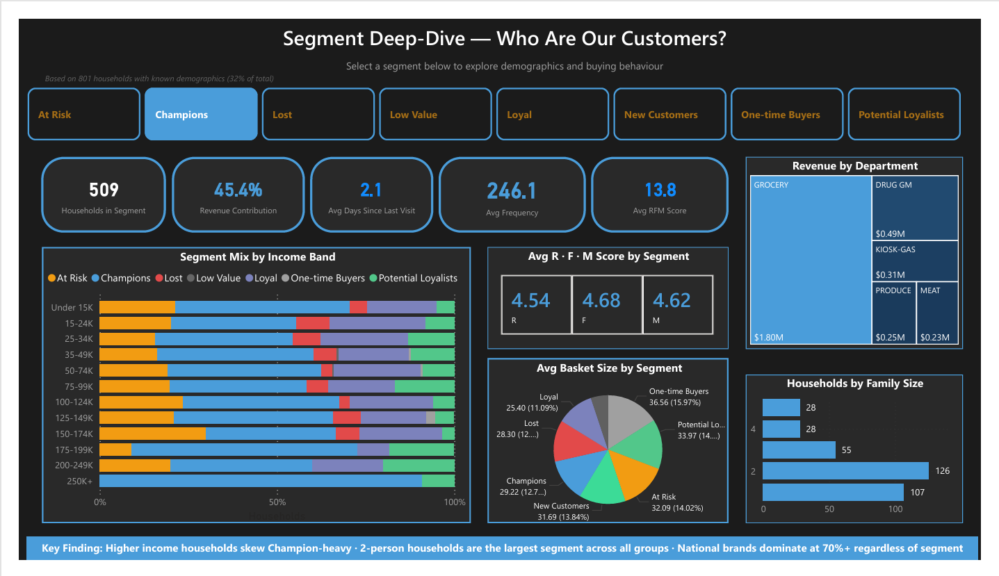

# 🛒 RFM Customer Segmentation
### Dunnhumby — The Complete Journey | Python · Power BI

A grocery retailer had **2 years of transactions and zero customer intelligence**. I built an end-to-end RFM pipeline that segments 2,500 households and exposes where their marketing money is being wasted.

```
2.6M transactions → cleaned → RFM scored → 8 segments → Power BI dashboard
```

---

## The Findings That Matter

- 🏆 **Champions are 20% of customers but drive 45% of revenue** — and the business can't name a single one
- ⚠️ **43% of households show churn signals** (At Risk + Lost)
- 💸 **Champions absorb 60% of coupon value** — despite buying without any incentive
- 🎯 **Frequency beats basket size:** Champions spend *less* per trip ($29) than One-time Buyers ($37) — but visit 246× vs 1×

---

## Dashboard — Segment Deep-Dive

*Interactive slicer drives demographics, product behaviour, RFM scores and basket analysis per segment.*



📊 **[Interactive Dashboard (.pbix)](https://drive.google.com/file/d/1FVWRXMAGhvVRbKGhjglqDA0D-tWK2nkj/view?usp=sharing)** · 📄 **[Full PDF — all 4 pages](RFM_Customer_Segmentation.pdf)** (no software needed)

---

## How It Works

**RFM Engine (Python)** — Recency, Frequency, Monetary scored per household via `pd.qcut()` quintile binning. All three distributions are heavily right-skewed, so equal-width bins would have dumped 90% of customers into one score. Quintiles force real differentiation.

**8 Segments** — from Champions to Lost, via rule-based logic on combined RFM scores.

| Segment | Count | Revenue % |
|---------|-------|-----------|
| Champions | 509 | 45.4% |
| At Risk | 565 | 18.4% |
| Loyal | 330 | 17.0% |
| Potential Loyalists | 306 | 8.5% |
| Lost | 500 | 8.1% |
| *+ 3 smaller segments* | | |

---

## The Wasted Spend Story

Champions get targeted **99% of the time** — campaigns they don't need. The "response rate" is just measuring how often they were already going to shop. Meanwhile **At Risk** (18% of revenue) has the worst targeting gap, and the most-used campaign type reaches the *fewest* households.

**Recommendation:** cut Champion spend 30–40%, redirect coupons to Potential Loyalists who actually need the habit nudge, and close the At Risk gap fast.

---

## Tech Stack

`Python (pandas, numpy)` · `Matplotlib` · `Power BI (DAX)` · [Dunnhumby dataset (Kaggle)](https://www.kaggle.com/datasets/frtgnn/dunnhumby-the-complete-journey)

📁 Full pipeline: `RFM_Engine.ipynb` · Output: `rfm_segments.csv` · Deck: `RFM_Customer_Segmentation.pptx`

<sub>No campaign control group, so response rates are directional not causal. Demographics cover 32% of households.</sub>
