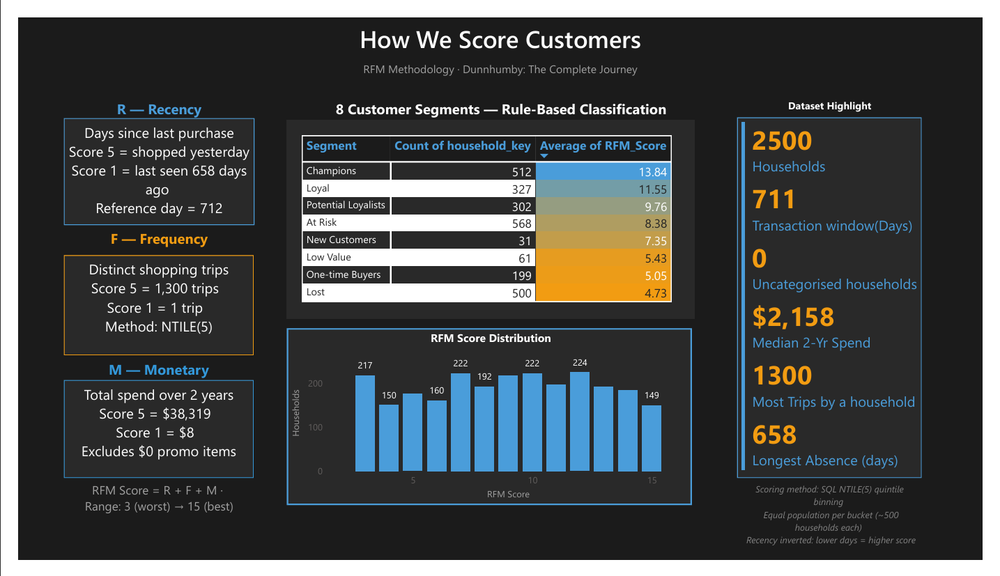
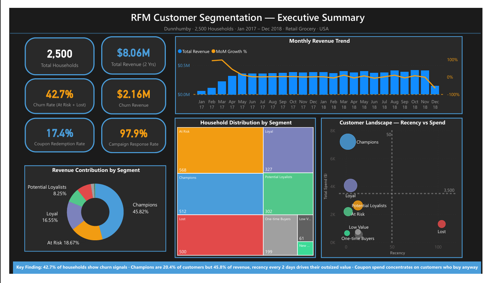
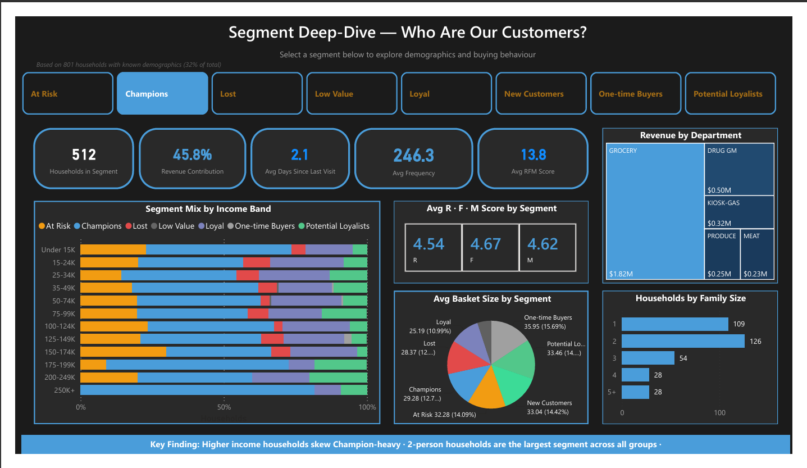
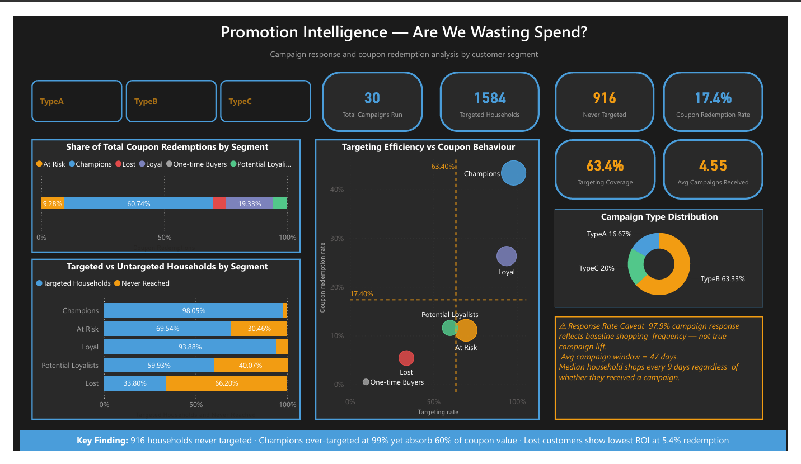

# 🛒 RFM Customer Segmentation

### Dunnhumby — The Complete Journey | Python · Azure SQL · Power BI

> *"The retailer treats all 2,500 households the same. Who's worth keeping? Who's already gone? And are we wasting money on customers who'd buy anyway?"*

---

## The Short Version

A retail grocery chain had two years of transaction data and no customer intelligence. I scored all 2,500 households on Recency, Frequency and Monetary value, split them into eight segments, and used that to test whether the promotion budget was reaching the right people.

It wasn't.

- 🏆 **Champions are 20.5% of customers but drive 45.8% of revenue**, and the business has no way to identify them
- ⚠️ **42.7% of households show churn signals**, worth $2.16M in revenue
- 💸 **916 households have never received a single campaign**, while Champions get 98% coverage
- 🎟️ **Champions absorb 60.7% of all coupon redemptions** despite shopping every 2.1 days without incentives

The project was built twice. First in pandas, then rebuilt on Azure with the scoring logic moved into SQL. The second build found three data quality problems the first one had silently absorbed.

---

## Pipeline

```
7 CSVs  →  ADLS Gen2  →  Azure SQL (stg → silver → gold)  →  Power BI
                              ↑
                    NTILE(5) quintile scoring,
                    segment rules in T-SQL
```

| Layer | Tool | What it does |
|---|---|---|
| Prototype | Python (pandas, numpy) | EDA, `pd.qcut()` scoring, segment rules, campaign and coupon analysis |
| Lake | ADLS Gen2 | Raw CSVs, hierarchical namespace, managed-identity access |
| Warehouse | Azure SQL Database (serverless) | `stg` untyped landing → `silver` typed and keyed → `gold` RFM output |
| Transform | T-SQL | `NTILE(5)` and `CASE WHEN`, running next to the data |
| Serving | Power BI (DAX, Import mode) | 4-page dashboard, star-schema model |

Dataset: [Dunnhumby — The Complete Journey](https://www.kaggle.com/datasets/frtgnn/dunnhumby-the-complete-journey) (Kaggle, free account).

---

## 8 Customer Segments

Rule-based classification over 2,595,732 transactions. Zero households fell through the rules.

| Segment | Households | Avg RFM Score | Revenue % | Rule |
|---|---|---|---|---|
| Champions | 512 | 13.84 | 45.8% | R≥4, F≥4, M≥4 |
| At Risk | 568 | 8.38 | 18.7% | R∈[2,3], F≥2, M≥2 |
| Loyal | 327 | 11.55 | 16.6% | F≥4, R≥3 |
| Potential Loyalists | 302 | 9.76 | 8.3% | R≥4, F∈[2,3] |
| Lost | 500 | 4.73 | 8.2% | R=1 |
| One-time Buyers | 199 | 5.05 | 1.9% | R∈[2,4], F=1 |
| Low Value | 61 | 5.43 | 0.4% | R∈[2,3], F≥2, M=1 |
| New Customers | 31 | 7.35 | 0.2% | R=5, F=1 |

Quintile binning rather than fixed cutoffs, because all three distributions are heavily right-skewed. Monetary runs from $8.17 to $38,319 with a median of $2,157. Equal-width bins would have dropped roughly 90% of households into the bottom tier.

---

## Dashboard

📊 **[Interactive dashboard (.pbix)]([[https://drive.google.com/file/d/1FVWRXMAGhvVRbKGhjglqDA0D-tWK2nkj/view?usp=sharing](https://drive.google.com/file/d/12aVgtJ9yynjYzScM-Bt5zCM-6JYTtvea/view?usp=drive_link)](https://drive.google.com/file/d/12aVgtJ9yynjYzScM-Bt5zCM-6JYTtvea/view?usp=sharing))** — needs Power BI Desktop (free)
📄 **PDF export** in this repo shows every page with key segment selections, no software needed

### Page 0 — How We Score Customers

*RFM methodology, segment rules, score distribution, dataset bounds*



### Page 1 — Executive Summary

*Business scale, revenue concentration, churn exposure, customer landscape*



### Page 2 — Segment Deep-Dive *(Champions selected)*

*Demographics, department spend, RFM scores and basket behaviour. The tile slicer drives every visual on the page.*



### Page 3 — Promotion Intelligence

*Targeting coverage, coupon concentration, campaign type efficiency*



---

## The Finding That Surprised Me

Champions spend **$29.28 per trip**. One-time Buyers spend **$35.95**.

Champions made 246 trips over two years. One-time Buyers made one.

Basket size is the wrong metric for customer value, and it's the one most retailers optimise. A One-time Buyer's "average basket" is just their single visit. Champions' value is built from visiting every 2.1 days, not from spending more each time.

---

## Where the Promotion Budget Goes

| Segment | Targeting Rate | Share of Coupon Redemptions |
|---|---|---|
| Champions | 98.1% | 60.7% |
| Loyal | 93.9% | 19.3% |
| At Risk | 69.5% | 9.3% |
| Potential Loyalists | 59.9% | 5.7% |
| Lost | 33.8% | 5.0% |
| One-time Buyers | 10.1% | 0.04% |
| Low Value | 0.0% | 0.0% |

Champions receive almost every campaign and take three in five coupons, while shopping continuously whether or not a campaign is running. At Risk, the largest segment and the one still recoverable, is reached 69.5% of the time.

**The 97.9% campaign response rate is not evidence of anything.** The average campaign window is 47 days and the median household shops every 9 days. Nearly everyone transacts inside any 47-day window regardless of what was sent to them. There is no control group in this dataset, so campaign lift cannot be measured, only asserted.

Campaign type makes it worse:

| Type | Share of campaigns | Household coverage |
|---|---|---|
| TypeB | 63.3% | 40.9% |
| TypeC | 20.0% | 15.9% |
| TypeA | 16.7% | 60.5% |

TypeB runs nearly four times as often as TypeA yet reaches a third fewer households. It targets the same people repeatedly instead of widening reach.

---

## Recommendations

1. **Cut Champion campaign spend by 30–40%.** 98% coverage for customers who visit every 2.1 days without prompting. Replace with loyalty recognition, which costs less per household.
2. **Close the At Risk targeting gap.** 568 households, 18.7% of revenue, 30.5% never reached. Recency has slipped but frequency and spend haven't collapsed, so they're still reachable in-store.
3. **Point coupons at Potential Loyalists.** 302 households visiting recently but infrequently, with a $33.46 basket. A coupon could build a habit there. Champions redeem without changing behaviour.
4. **Rebalance campaign types.** TypeB's 63% share buys the worst coverage of the three. Redistributing toward TypeA's pattern would widen the funnel without more spend.

---

## What the Azure Rebuild Caught

Moving from pandas to a typed warehouse surfaced three things the first build had absorbed without comment. Details in [`azure/README.md`](azure/README.md).

**56 rows of floating-point noise.** `BULK INSERT` aborted on `5.551115E-17` in `SALES_VALUE`. These are residuals from the source system's arithmetic, semantically zero, all on rows with zero quantity. `float64` parses exponent notation; `BULK INSERT` into a `DECIMAL` column does not. Fixed by landing staging as text and casting through `FLOAT` in the transform, so loads never fail on data quality.

**5,164 duplicate coupon rows, 4.1% of the file.** `coupon.csv` has three columns and its natural key isn't unique across them, so every duplicate is a byte-identical row. The silver layer's primary key rejected them. Deduplicated with `DISTINCT`, and the gap between staging and silver row counts is now a measurable number rather than an invisible one.

**A wrong measure in the original dashboard.** Checking the warehouse against the BI layer showed the coupon share visual was normalising redemption *rates* instead of counting redemptions, reporting Champions at 30% when the real figure is 60.7%. The pandas version had the same bug and nothing had caught it, because 30% looked plausible.

Segment counts also shift by up to 4 households between the two implementations. `NTILE(5)` forces exactly 500 rows per bucket; `pd.qcut` keeps tied values together. Recency is heavily tied at low values (367 households at 1 day, 262 at 2), so the bucket boundary falls inside a tie group. `Lost` matches exactly at 500 in both, because it's defined as R=1 and that's a boundary `NTILE` guarantees.

---

## Data Limitations

- Demographic data covers 801 of 2,500 households (32%). Income and family-size findings are directional.
- `DAY` is an integer 1–711. Day 1 is assumed to be 1 January 2017, the standard assumption for this dataset. Calendar labels shift if that's wrong; RFM calculations don't.
- No campaign control group, so response rates cannot be read as causal lift.
- RFM scores cover the full two-year window. A customer active in year 1 and gone in year 2 scores higher than their recent behaviour warrants. A rolling window would fix this.
- One household recorded 1,300 trips over 711 days, roughly 1.8 per day. Likely a commercial account. Retained and flagged rather than silently dropped.

---

## Repo Contents

| Path | What it is |
|---|---|
| `RFM_Engine.ipynb` | Python pipeline with verification output at every stage |
| `rfm_segments.csv` | 2,500 scored households, the pandas output |
| `azure/README.md` | Azure architecture, service choices, what was deliberately left out |
| `azure/sql/01_create_schema.sql` | Schemas, 15 tables, covering index |
| `azure/sql/02_bulk_insert_staging.sql` | Managed-identity setup, seven loads, row-count checks |
| `azure/sql/03_staging_to_silver.sql` | Casts, deduplication, key enforcement |
| `azure/sql/04_rfm_transform.sql` | `NTILE(5)` scoring and segment rules |
| `RFM_Customer_Segmentation.pptx` | 11-slide walkthrough: methodology, findings, limitations, recommendations |
| `RFM_dashboard.pdf` | All four dashboard pages as static images |
| [.pbix on Drive](https://drive.google.com/file/d/1FVWRXMAGhvVRbKGhjglqDA0D-tWK2nkj/view?usp=sharing) | Interactive dashboard, 27 MB so hosted outside the repo |

Dataset not included. Download from [Kaggle](https://www.kaggle.com/datasets/frtgnn/dunnhumby-the-complete-journey).

---

## Cost

The Azure build runs at $0. Azure SQL's free offer covers 100,000 vCore-seconds and 32 GB per month for the lifetime of the subscription, with overage billing disabled so the database pauses rather than charges. Storage is a few hundred MB against a 5 GB free allowance, costing roughly half a cent a month once that expires.

---

*Python, Azure SQL and Power BI. Dataset: Dunnhumby The Complete Journey.*
